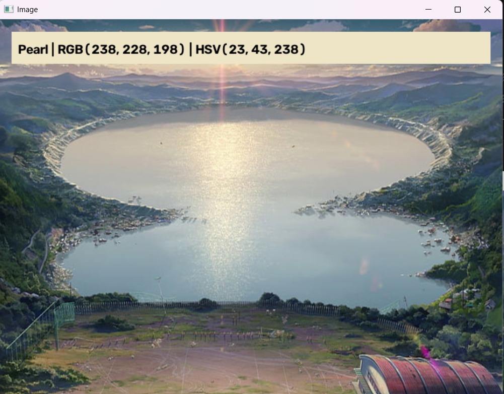
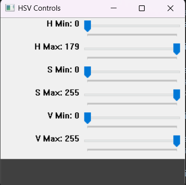
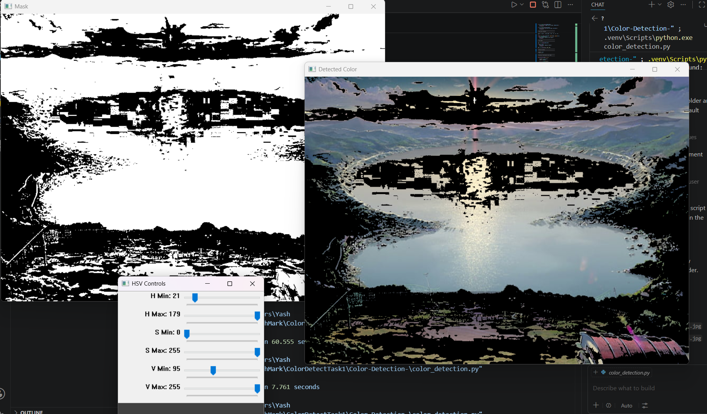

# 🎨 Color Detection Using OpenCV


An interactive **Color Detection** application built with **Python**, **OpenCV**, **NumPy**, and **Pandas**. This project identifies the nearest color by double-clicking on an image and allows users to experiment with HSV thresholding using interactive trackbars.

---

## ✨ Features

- 🎯 Detect the nearest color name from a color database.
- 🖱️ Double-click anywhere on the image to identify a color.
- 🌈 Display:
  - Color Name
  - RGB Values
  - HSV Values
- 🎚️ Interactive HSV Trackbars
- 🎭 Live HSV Mask Preview
- 🖼️ Live Color Detection Result
- 📂 Supports multiple images through command-line arguments.
- ⚠️ Error handling for missing image and CSV files.

---

## 📂 Project Structure

```text
Color-Detection-Using-OpenCV/
│
├── color_detection.py
├── colors.csv
├── colorpic.jpg
├── pic1.jpg
├── pic2.jpg
├── pic3.jpg
├── requirements.txt
├── README.md
├── LICENSE
├── .gitignore
└── screenshots/
    ├── demo1.png
    ├── demo2.png
    └── demo3.png
```

---

## 🛠️ Technologies Used

- Python
- OpenCV
- NumPy
- Pandas

---

## 📦 Installation

Clone the repository:

```bash
git clone https://github.com/YashKumar546/Color-Detection-Using-OpenCV.git
```

Move into the project directory:

```bash
cd Color-Detection-Using-OpenCV
```

Install the required dependencies:

```bash
pip install -r requirements.txt
```

---

## 🚀 Usage

Run with the default image:

```bash
python color_detection.py
```

Run with a specific image:

```bash
python color_detection.py pic2.jpg
```

Run with your own image:

```bash
python color_detection.py myimage.jpg
```

Use a custom color database:

```bash
python color_detection.py pic2.jpg --csv colors.csv
```

---

## 🎮 Controls

| Action | Function |
|--------|----------|
| 🖱️ Double Left Click | Detect color |
| **R** | Reset detected color |
| **ESC** | Exit application |

---

## 🧠 How It Works

1. Loads the selected image.
2. Converts the image from **BGR** to **HSV** color space.
3. Uses HSV trackbars to generate a color mask.
4. Detects the RGB value of the pixel on double-click.
5. Searches the nearest matching color from `colors.csv`.
6. Displays:
   - Color Name
   - RGB Values
   - HSV Values
7. Shows:
   - Original Image
   - HSV Mask
   - Detected Color Result

---

## 📸 Screenshots

### Original Image



### HSV Mask



### Detected Color



---

## 📈 Future Improvements

- Real-time webcam color detection.
- Detect multiple colors simultaneously.
- Draw contours around detected objects.
- Save detected color information.
- Export HSV values.
- Build a graphical interface using Tkinter or PyQt.

---

## 🤝 Contributing

Contributions are welcome!

1. Fork the repository.
2. Create a new feature branch.
3. Commit your changes.
4. Push the branch.
5. Open a Pull Request.

---

## 📄 License

This project is licensed under the **MIT License**.

---

## 👨‍💻 Author

**Yash Kumar**

- GitHub: https://github.com/YashKumar546

---

⭐ **If you found this project useful, consider giving it a star on GitHub!**
